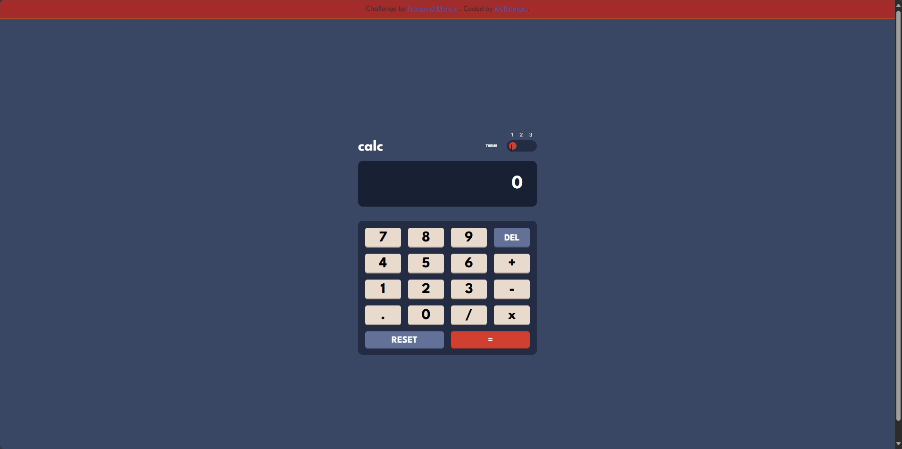

# Frontend Mentor - Calculator app solution

This is a solution to the [Calculator app challenge on Frontend Mentor](https://www.frontendmentor.io/challenges/calculator-app-9lteq5N29). Frontend Mentor challenges help you improve your coding skills by building realistic projects. 

## Table of contents

- [Overview](#overview)
  - [The challenge](#the-challenge)
  - [Screenshot](#screenshot)
  - [Links](#links)
- [My process](#my-process)
  - [Built with](#built-with)
  - [What I learned](#what-i-learned)
- [Author](#author)

**Note: Delete this note and update the table of contents based on what sections you keep.**

## Overview

### The challenge

Users should be able to:

- See the size of the elements adjust based on their device's screen size
- Perform mathmatical operations like addition, subtraction, multiplication, and division
- Adjust the color theme based on their preference
- **Bonus**: Have their initial theme preference checked using `prefers-color-scheme` and have any additional changes saved in the browser

### Screenshot

### Links

- Solution URL: [Add solution URL here](https://your-solution-url.com)
- Live Site URL: [https://calculator-app-wheat-omega.vercel.app/](https://calculator-app-wheat-omega.vercel.app/)

## My process

### Built with

- Semantic HTML5 markup
- CSS custom properties
- Flexbox
- JavaScript

### What I learned

I've learned to make use of themes in CSS, using CSS variables and data-theme, also improved my JavaScript skills by creating the calculator logic, expecially in the numberPressed() function, which I was struggling with numbers not showing the in calculator.

## Author

- Website - [Wellington Lopes Nunes](https://wellington-lopes-portfolio.vercel.app/)
- Frontend Mentor - [@wells2232](https://www.frontendmentor.io/profile/wells2232)
- Twitter - [@wellindo_](https://x.com/wellindo_)
